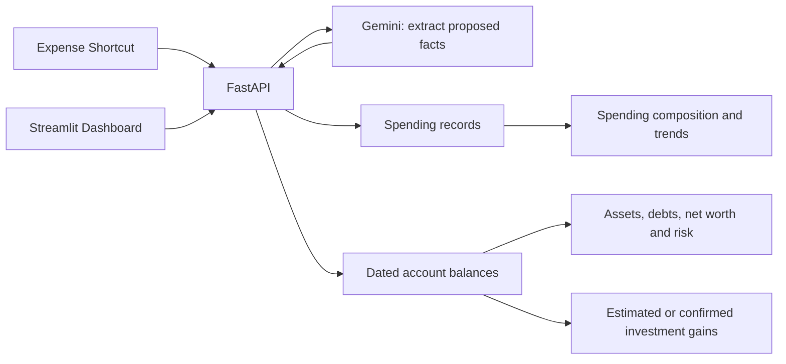

# VibeLedger: household wealth and spending

Status: **Simplified target, revised 2026-09-06; S1/S2 accepted, S3 in progress as of 2026-09-11.** This replaces the
Phase 12.5 architecture. The existing staging implementation is the starting point.
Read [the implementation contract](docs/architecture/CONTRACTS.md) and
[transition and acceptance plan](docs/architecture/IMPLEMENTATION_PLAN.md) next.

## 1. Product promise

Two household members can see what they own, what they owe, how their investments
have performed, and where everyday spending goes. Clear expense screenshots are
recorded without a conversation. Periodic account-overview screenshots or manual
balance updates keep the wealth picture useful.

The system does not promise a complete bank ledger, live balances, audited cash
flow, portfolio accounting, or recovery of expenses without capture/import evidence. Show these
limits through dates and coverage, rather than filling gaps with invented
transactions, zero balances, or investment profits.

### The central decision: two independent records

1. **Spending records:** expenses, refunds, and optional income entries.
2. **Balance observations:** the amount reported for an account at a stated time.

An expense never changes a balance observation. A new balance never creates an
expense, income, transfer, opening-balance transaction, or balancing adjustment.
There is no calculated account balance to reconcile. Investment gains are a
separate calculation between observations, using confirmed flows when supplied and
an explicitly labelled zero-flow estimate otherwise. Statements can supply both
spending and a dated balance, without making one determine the other.



Maintaining trustworthy projected balances would require capturing every salary,
transfer, repayment, fee, refund, settlement and contribution. That obligation is
absent from the actual product goals. Last reported balances are the smaller model.

## 2. Everyday workflows

### A. Capture spending

Keep the physically tested experience:

```text
payment screenshot -> Shortcut compresses/encodes -> POST /api/v1/expenses
  clear expense -> recorded; short amount/merchant/category summary
  uncertain fact -> confirm, correct in ordinary language, or cancel
```

The normal new-expense path has **one backend request**. No preflight account,
category, authentication, status, or FX request is added. Keep the device token and
plain-text pending key in local iPhone storage. Recovery may use extra requests;
its race-safe behavior is specified in CONTRACTS.

The backend validates proposed facts; Gemini cannot authorize writes. Amount,
currency, expense intent, and date must be reliable. Keep the existing field-level
confidence starting threshold of 0.85 and tune against household fixtures, not the
model's overall confidence alone. A new merchant or large amount alone does not interrupt.

Payment account is useful metadata, **not a required accounting leg**. If only the
account is unknown, record the otherwise clear expense with `account_id = null`;
show “payment account unknown” in detail. Never pick a default account or guess
among aliases. This also allows spending before balances are initialized.
A low-confidence category goes to visible **Other**, editable later, without blocking
an otherwise clear purchase.

These saved expenses remain included in spending immediately. Show **Missing account**
and **Category uncertain** badges, counts and filters in Spending and the same records
in Review. A single record can carry both reasons. Choosing a category explicitly
(including Other) resolves category uncertainty; choosing an account resolves the
account flag. “Leave account unknown” acknowledges the omission without inventing an
account: it leaves the Missing account filter available but removes that review task.
Do not confuse an intentionally chosen Other with an AI uncertainty fallback. Corrections
edit the existing transaction with version checks and history, never create another expense.

Use the receipt's business date when readable. If no date is shown, a clearly current
successful-payment screen may use the capture's local date with `date_source = capture_date`.
A historical list, ambiguous year, unreadable visible date, pending payment, or failed
payment requires review. Known failed payments are rejected, never recorded.

Transfers, card repayments, loan principal repayments, and investment deposits are
not spending. Return an explanatory rejected result for an unambiguous non-expense;
ambiguous person-to-person payments require review. Never force everything sent to
the expense entry point into an expense. Refund capture is an explicit Dashboard
action in this release; a clear refund screen directs the user there.

### B. Update wealth

The Wealth page offers **Update balances**, by screenshot or a manual table. An
optional separate balance Shortcut can use the same backend; it does not change
the Expense Shortcut.

1. Extract visible amounts, labels, currencies, times, and balance/debt/total meaning.
2. Map only to active household accounts with clear identity and matching currency.
3. Clear non-overlapping rows can save automatically. Return the saved account list.
   All selected rows in one submission commit together.
4. Uncertain identity, scope, currency, amount, or debt meaning produces one editable
   review table. The user may correct, explicitly create an account, or explicitly
   exclude a row and save the remainder. No second reconciliation review.
5. Manual Save is already confirmation. A change from the last balance never creates
   a discrepancy task or requires an explanation.

The first observation starts that account's history; no household-wide opening
ceremony. Zero is valid; missing is not zero. Older observations enter history
without replacing a newer current observation. Future-dated balances are rejected.

#### Avoid counting money twice

Each account has a short `balance_scope`, such as “brokerage total, including cash
and holdings” or “Alipay equity funds only; excludes wallet”. Accounts are flat.
The setup UI explains that tracked accounts must cover distinct money. A brokerage
total and its holdings cannot both be included. Splitting helps risk reporting,
but the aggregate then remains a screenshot cross-check only.

Institution totals, subtotals, yesterday's earnings, credit limits, available credit,
and maturity proceeds are never additional balances. Cross-check a total only when
its currency and included rows are known. Cropped screens or totals spanning other
currencies cannot supply an equation for selected rows. Genuine mismatches need
review; CONTRACTS defines display-rounding tolerances. Never invent a missing row
or adjustment. Across uploads, configured account scopes remain the overlap guard;
AI cannot prove that two real-world accounts are distinct.

#### Debts use the same observations

Capture a card's **total amount currently owed**, including unbilled purchases and
remaining installment principal where applicable. This month's bill, minimum due,
available credit, and credit limit used are not substitutes. If total debt is
unavailable, retain the dated prior value and ask for a total or manual amount;
do not silently omit the card from completeness.

The UI accepts a positive “Amount owed”; storage is negative. Explicit card
overpayments are positive; overdrafts are negative. Loans use outstanding principal,
excluding future interest. No statement calendar, due calculation, or reminder engine.

### C. Import a statement for a selected account

Enable **Statement import** per account in Settings. From Spending or Wealth, select
that account and upload its PDF. Show one preview containing spending rows and an
optional dated closing balance. The user resolves ambiguous amounts/dates/types and
possible duplicates, then saves the selected spending and balance together. They may
explicitly exclude an unusable balance and still import spending, or import only the
balance. The screen reports exactly what was saved, linked to an existing record, or skipped.

The statement can backfill missed spending. It never calculates a balance from the
rows, forces spending to match a total, or creates adjustments. Transfers, repayments,
opening balances and investment trades are excluded. Refunds are separate refund
records; uncertain categories use flagged Other. Fees are ordinary expenses. A known
statement account supplies payment metadata; users need not select it on every row.

Repeat files and overlapping statements must not silently duplicate expenses, including
those already captured by Shortcut or recorded by a schedule. Exact bank transaction
identifiers can establish identity; other plausible duplicates need one explicit
link/skip/create choice in the preview. Linking preserves the existing record; a
different amount/date is an explicit correction, never an automatic overwrite.

A statement's balance is an observation **as of its own date**, not the upload date.
An old statement never replaces a newer current observation. Credit statements showing
only this month's bill cannot establish total debt; leave balance import unselected
unless its full scope is clear. Completeness describes the imported document/selection,
not all household spending. No statement matching engine, residual thresholds, monthly
close, settlement-leg enrichment or investment-flow inference is reintroduced.

### D. Understand investment gains

An investment account is a total-value bucket, not a security position. At its
balance update ask optionally: **“Since the previous update, how much money did
you add or take out?”** Offer confirm no movement, enter totals, or leave estimated.
If no complete flow information is supplied, use zero additions and withdrawals for
an **estimated** gain. This is an assumption, never a claim that no transfers occurred.
Save the balance regardless of whether the user confirms the interval.

For consecutive valid observations of the same investment account and currency:

```text
gain = closing balance - opening balance - money added + money taken out
```

100,000 -> 160,000 with 50,000 added means a gain of 10,000. Without knowing the
addition, show “estimated gain 60,000; assumes no money added or withdrawn”. Once the
user confirms 50,000 added and zero withdrawn, show “confirmed gain 10,000”. Explicit
confirmation of zero flows also produces confirmed gain; merely omitting the fields does not.

“Taken out” includes distributions paid outside the account. Reinvested income and
internal trades are already inside its value. Internal investment fees reduce its
gain; do not generate another daily expense automatically. This measures account
gain after internal charges, not tax or externally paid fee accounting.

The user supplies **complete** addition/withdrawal totals for the interval. Gemini
may prefill explicitly shown flows covering that interval, but the user must confirm
completeness. Daily/lifetime/provider earnings are not substitutes. The initial
release does not aggregate incompatible provider metrics. No positions, lots,
cost basis, realized/unrealized split, return percentage, time-weighted return, or IRR.

For estimated intervals, surface an **Unusual investment change** in Review when
`abs(closing - opening) >= 20% * abs(opening)`. If opening is zero, any nonzero closing
value triggers review; zero-to-zero does not. This is an initial adjustable household
threshold, applied to the actual interval without annualizing or inferring risk.
Show dates, values, assumed flows and the estimated gain. The user confirms no movement
or enters actual additions/withdrawals. A confirmed interval needs no further unusual-
change prompt. Leaving it estimated keeps the review item; it never blocks wealth
updates or spending. Small unflagged changes remain estimates too.

Store confirmed flow inputs linked to opening and closing observation IDs; calculate gains
on read. Correcting, voiding, or inserting an observation between the pair invalidates
that pairing for reports. Keep old inputs in history; new intervals return to zero-flow
estimates and rerun the unusual-change rule. Never copy/apportion confirmed flows.

Show actual interval dates per account. A filtered sum includes only whole eligible
intervals contained in that range; list gaps, boundary-crossing intervals, and
accounts without two observations. Never prorate calendar-month performance. Group by
native currency. An optional reporting-currency estimate uses each interval's
closing-date rate, labelled translated account gains, excluding currency revaluation
of household assets. Show confirmed gains, estimated gains and their combined amount
separately; a combined amount containing estimates is labelled estimated, never confirmed.
Missing observations/FX and uncovered ranges still make totals partial. The first
observation alone has unavailable gain, rather than an invented opening value of zero.

## 3. Records and reporting rules

### Household and accounts

Retain the household, two users, membership checks, and revocable device tokens.
Both users see and correct all household finance records. Account ownership is
descriptive; no private subledgers or spouse settlements. Keep existing owner/member
roles for device administration without adding a permission system.

Retain `cash`, `savings`, `investment`, `credit`. Credit covers liability accounts,
including consumer loans. Type is descriptive, not a separate workflow. One currency
per account; split multicurrency accounts. Type and currency become immutable after
any observation or transaction references the account. No billing/due days, linked
cash account, institution entity, asset-class taxonomy, or parent account. Institution
names may appear in ordinary names, aliases, and scope descriptions.

Risk is user-selected `very_low`, `low`, `medium`, `high`, or null (unclassified).
Gemini never chooses risk. Credit accounts have null risk. A mixed investment bucket
can be split into distinct accounts for risk reporting or left broadly classified.

Accounts have `opened_on` (default local creation date) and optional `closed_on`.
Closing requires an explicit zero closing observation and no later active observation.
An unused, uninitialized account can be cancelled without asserting it ever held zero.
There is no “hide nonzero account from wealth” toggle. History remains visible.
Correcting a closing observation must preserve closure conditions or explicitly reopen
the account in the same operation.

### Spending, income and refunds

Keep the `transactions` table name for reuse, with only `expense`, `refund`, and
`cash_income`. One positive original amount/currency, optional payment account,
category, business date, merchant, note, and provenance suffice. No from/to legs.

```text
recorded spending = expenses - refunds received in the reporting date range
recorded income = optional cash_income entries in that range
```

Fees paid as household purchases are ordinary expenses. Show gross purchases,
refunds, and net spending. Negative net spending by category/month is valid: use
bars/tables rather than forcing it into a pie. Optional income capture is not a
complete cash-flow system; do not present a reliable saving rate or explain
net-worth changes through income minus spending.

A refund is a separate positive record on its received date. If its purchase is
known, use `refund_of_transaction_id`, copy the category at creation, require the
same original currency, and prevent active refunds exceeding the purchase. A missing
or pre-start purchase permits an unlinked refund with explicit category and note.
No fuzzy refund matching. Original category edits do not silently alter refunds;
they remain individually editable. A purchase cannot be voided or reduced below
active refunds until those refunds are explicitly corrected or unlinked.

#### Recurring and installment spending schedules

In Spending, **Add schedule** accepts recurring/installment, amount per period,
currency, number of periods, first month, day of month, merchant/description, category,
and optional payment account. Installments require a finite positive count; recurring
expenses may have a count or continue until paused/cancelled. Preview the dates and
amounts before Save. Days 29–31 clamp to the month's last day, returning to the requested
day in longer months. Dates follow the household timezone.

A user-authorized schedule records one expense on each due date. A 12-period plan
of 1,000 records 1,000 each month, **not 12,000 upfront plus 12 more expenses**. Future
periods are a preview, excluded from actual spending; no future financial transactions.
Scheduled expenses are labelled so the user can skip a period, correct an amount,
pause or stop the schedule. Paused periods are skipped, not charged on resume.
Fixed fees included in the per-period amount are already spending and cannot be added
again. This monthly spending convention supersedes the previous purchase-date-only rule.

Schedule creation does not change wealth or calculate debt. Card/loan observations
still include all remaining principal as reported. The schedule is not a payment
instruction or a credit-billing/loan amortization engine. Ordinary card repayments
are excluded from spending; the scheduled purchase allocation is recorded once.

An installment purchase screenshot without an established period association goes to
review with a Dashboard schedule action; do not silently book its full total and a
schedule. A user may explicitly keep a one-off full purchase instead. If switching
that purchase to a schedule, atomically void the identified full-price expense and
create the schedule after preview; linked refunds must be resolved first. Statements,
Shortcut captures and scheduled periods representing the same expense must link to
one transaction, never accumulate copies. CONTRACTS specifies cross-source identity.

### Categories

Seed the previously discussed categories plus **Other**. Users may rename, describe,
add, and archive categories; stable IDs preserve history. Keep Other active as the
fallback (its display label can be localized). No immutable 14-category subsystem,
priority field, rule engine, or training job. Pass active names and descriptions
from PostgreSQL to Gemini.

| Initial expense name | Classification meaning |
|---|---|
| Grocery | Groceries, household consumables, ingredients |
| Dine | Restaurants, takeaway, coffee, drinks and ready-to-eat snacks |
| Child | All explicitly child-related purchases, including health, clothing and education; precedes those adult categories |
| Home & Utilities | Rent, utilities, maintenance, appliances; excludes loan principal, includes identifiable mortgage interest |
| Digital & Gadgets | Phones, computers, accessories and electronics |
| Clothing | Adult clothing, shoes and accessories |
| Beauty | Adult skincare, cosmetics, haircuts and personal care |
| Transportation | Transit, taxi, fuel, parking, maintenance and tolls |
| Health | Adult medicine, care, checkups and medical insurance |
| Education | Adult books, training, software and AI subscriptions |
| Gift & Socials | Gifts, social occasions and cash gifts to parents |
| Parents | Specific goods/services for parents, excluding cash gifts |
| Fun & Games | Routine entertainment, games, cinema and recreation |
| Trips & Occasions | Holidays, anniversaries and distinct major occasions |
| Other | Clear expenses without a sufficiently reliable category |

Seed editable income categories Salary, Interest, Other income.

### Wealth, history, freshness and risk

For each account included at time T, choose its newest active observation with
`as_of <= T`. Never add subsequent transactions. Label the current card **Last
reported wealth**, with account dates and the range of observation dates.

```text
assets = sum of positive converted balances
liabilities = sum of absolute negative converted balances
net worth = assets - liabilities
```

Missing observations, missing FX, or unresolved debt scope make coverage incomplete.
Show known subtotals and missing accounts; complete totals are null. Empty households
show setup, not “100% fresh / zero wealth”. Stale observations stay in known amounts:
show their ages, an update cue after 30 days, and prominent staleness after 90. These
are display thresholds, never write gates. Incomplete/stale pictures stay qualified.

Risk uses positive assets only, never net worth as denominator. Null-risk assets
and positive card overpayments are unclassified (identify surplus in detail).
Negative balances are debts, excluded from risk. Buckets sum to known positive
assets; if that sum is zero, percentages are null. Risk is current metadata;
historical risk allocation is not offered.

Wealth history is a step series carrying forward last observations, with gaps before
each account's first observation. Inclusion uses opened/closed dates; include closing
zero on the closing day. Late entries/corrections restate history. Each point carries
observation dates and missing/stale counts. Asynchronous observations are not a
verified same-day balance sheet; changes are not automatically investment gains.

### Money, dates and currencies

Keep PostgreSQL NUMERIC, Python Decimal, and JSON decimal strings. Retain original
amounts/currencies. Use existing minor-unit rules and ROUND_HALF_UP; no financial floats.
Reporting currency defaults to CNY, timezone to Asia/Singapore. Reporting currency
is fixed once records exist. Receipt/capture local dates govern expenses; household
timezone supplies manual-entry and report boundaries.

Spending uses a reference original-to-reporting quote for its business date, frozen
when first obtained. Account and purchase currencies may differ. Remove estimated
card settlement legs and statement replacement. Current wealth uses current available
quotes; historical wealth uses quotes no later than its date. Show quote dates and
reference-conversion labels. Missing rates never become 1.0 or zero: retain native
records and qualify partial totals. CONTRACTS defines retries and permitted quote age.

## 4. Dashboard and operations

Keep Streamlit and its REST client. Four pages suffice:

| Page | Contents and actions |
|---|---|
| Wealth | Last reported assets/debts/net worth, dated accounts, risk, history; Update balances; Investments subsection with interval gains and flow inputs |
| Spending | Trends and transactions; missing-account/uncertain-category filters; add/edit/refund/void; schedules with dates and period counts; statement import; optional income |
| Review | Drafts/import previews awaiting Save; separately labelled already-saved metadata corrections and unusual estimated investment gains |
| Settings | Accounts, scope, aliases, risk, statement-import toggle, categories, investment review threshold, devices, sign out |

History is a panel on each record, not an Audit center. No batches, candidates,
adjustments, correction-preview tokens, raw JWTs, or engine versions in daily UI.
One Save edits a record; conflicts ask the user to reload its current version.

Replace daily token-pasting with two pre-provisioned Supabase Auth email/password
accounts, per-session login/refresh/logout, and backend JWT verification. Reuse
verified-subject-to-user mapping. Device authentication stays. Credentials and setup
are operator work, not open product decisions; HMAC test tokens remain staging-only.

Keep one FastAPI service, one Streamlit service in Cloud Run asia-southeast1, and
Supabase PostgreSQL. Dashboard has no database credentials; private financial tables
are not exposed through the browser Data API. No worker, queue broker, Redis, event
bus, scheduled reconciliation, or portfolio service. AI runs inside HTTP handling,
outside database locks, with durable receipts protecting interruption recovery.
One authenticated Cloud Scheduler daily invocation materializes due spending periods
in the existing backend; catch-up on Dashboard use covers delayed/missed runs. No
additional worker service. This records expenses only, never initiates actual payments.

Store structured facts and minimal history; discard screenshots when processing
finishes. Never persist images, base64, raw model responses, passwords, tokens, or
full prompts in receipts, audit, logs, or errors. Statement PDFs use temporary storage
only during parsing and are deleted in success/failure cleanup; passwords stay in memory.
Keep sanitized extracted rows and document hashes for review and duplicate protection.

## 5. Deliberate tradeoffs

| Previous approach | Target decision and effect |
|---|---|
| Projected balances | Last observations only; wealth ages visibly, while missing transfers cannot fabricate a supposedly calibrated balance |
| Statements and reconciliation | Retain focused spending/balance import with preview and duplicate checks; remove ledger reconciliation, monthly closing and residual adjustments |
| Ordinary, credit, investment snapshot pipelines | One observation path; type-specific interpretation is validation |
| Persisted derived P&L and matched transfer legs | Derived zero-flow estimates or user-confirmed flow totals; unusual estimates appear in Review |
| Installment schedules and billing recognition | Simple monthly spending schedules; no statement-dependent billing engine or debt projection |
| Generic links and correction preview/commit | One refund link and one version-checked edit/void with history |
| Two reconciliation review lifecycles | Draft/import review plus derived follow-ups on saved expenses and estimated gains; no general work-order engine |
| Immutable canonical categories | Editable seeded vocabulary and fallback Other |
| Audit center and universal financial workflow | Minimal change history and durable receipts remain to solve real mistakes/retries |

These are implementation choices, not claims of delivered behavior. The 2026-09-06
requirements add monthly spending schedules, focused statement import, saved-expense
review and zero-flow gain estimates. No product question blocks implementation.
Live projected balances and general reconciliation remain outside scope.
