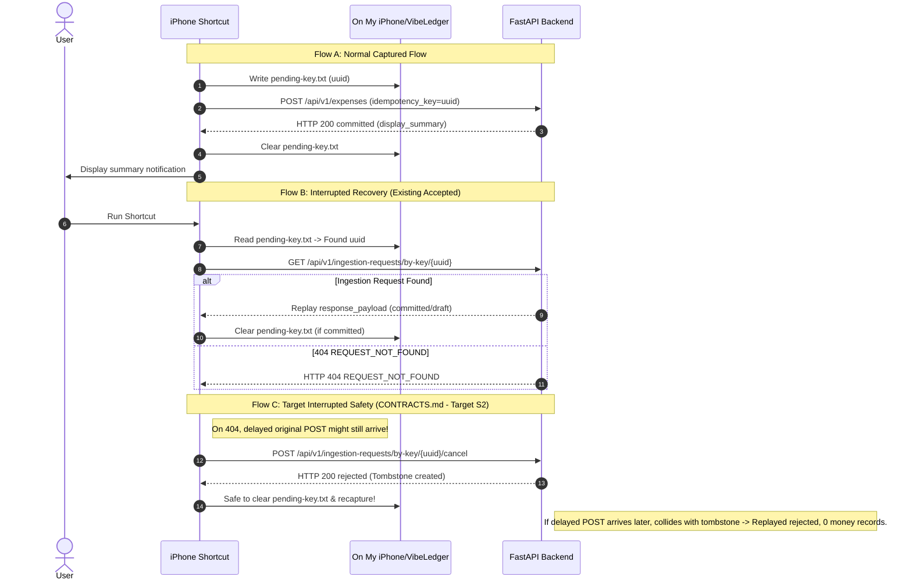

# VibeLedger S0: Expense Shortcut Compatibility Boundary & Baseline

Status: **Authoritative S0 Baseline (Revised 2026-09-06)**.  
Reference specifications: [TARGET_DOMAIN_MODEL](../../TARGET_DOMAIN_MODEL.md), [CONTRACTS](CONTRACTS.md), [IMPLEMENTATION_PLAN](IMPLEMENTATION_PLAN.md).

---

## 1. Executive Summary

This document freezes and characterizes the accepted iOS Expense Shortcut wire boundary and establishes a safe, reproducible runnable baseline for the Astra-simplified VibeLedger architecture.

Key principles established in S0:
1. **Zero Runtime Disruption**: S0 introduces no schema migrations, no changes to accepted staging services, and no changes to legacy production environments.
2. **One-Request Normal Path**: The physically accepted real-iPhone expense capture flow relies on a single `POST /api/v1/expenses` without preflights.
3. **Strict Boundary Characterization**: We document the exact fields currently consumed by the iPhone Shortcut and distinguish between **currently accepted Shortcut behavior** and **target cancellation contract behavior**.

---

## 2. iPhone Shortcut Wire Boundary

### 2.1 Device-Local Storage Contract

The iPhone Shortcut uses Apple Files app local storage (`On My iPhone`):
* Directory: `On My iPhone/VibeLedger/` (never iCloud Drive)
* `device-token.txt`: Contains the high-entropy opaque bearer token provisioned via `POST /api/v1/devices`. Sent as `Authorization: Bearer <token>`.
* `pending-key.txt`: Plain-text file containing an 8–200 character client-generated idempotency key (typically UUID v4). **Must never be stored as JSON**.

### 2.2 Normal Fast-Path Request (`POST /api/v1/expenses`)

The normal high-confidence capture path consists of exactly **one backend request**:

```json
{
  "idempotency_key": "8b9e6f1a-5c2d-4e3a-9f1b-7a8c9d0e1f2a",
  "captured_at": "2026-09-06T12:30:00+08:00",
  "client_version": "expense-shortcut-v2",
  "image": {
    "mime_type": "image/jpeg",
    "base64": "<base64_encoded_jpeg_bytes>"
  },
  "note": null
}
```

#### Request Field Specifications
| Field | Type | Required | Description / Invariants |
| :--- | :--- | :--- | :--- |
| `idempotency_key` | `string` | Yes | 8..200 chars, device-scoped unique key generated before POST. |
| `captured_at` | `string` | Yes | ISO 8601 with explicit timezone offset (e.g. `+08:00`). Non-timezone-aware dates are rejected with 422. |
| `client_version` | `string` | No | Client identifier, e.g. `expense-shortcut-v2`. |
| `image.mime_type` | `string` | Yes | Supported formats: `image/jpeg`, `image/png`. |
| `image.base64` | `string` | Yes | Valid base64 encoding. Max decoded size: 10 MiB. Validated by Pillow `verify()`. |
| `note` | `string` | No | Optional user annotation or hint. |

---

### 2.3 Response Contracts & Fields Consumed by Shortcut

#### A. High-Confidence Committed Response (HTTP 200)

```json
{
  "status": "committed",
  "request_id": "3fa85f64-5717-4562-b3fc-2c963f66afa6",
  "transaction_id": "c7a8b9d0-1234-4567-89ab-cdef01234567",
  "payment_mode": "one_off",
  "display_summary": "¥28.50 · 瑞幸咖啡\n招商银行储蓄卡 · 餐饮美食\n2026-09-06"
}
```

*Foreign-card additions (backward-compatible additive fields):*
```json
{
  "status": "committed",
  "request_id": "4ab96075-6828-4673-c40d-3da74077b0b7",
  "transaction_id": "d8b9c0e1-2345-4678-90bc-def012345678",
  "payment_mode": "one_off",
  "original_amount": "20.00",
  "original_currency": "USD",
  "from_amount": "144.00",
  "from_currency": "CNY",
  "account_leg_status": "estimated",
  "display_summary": "20.00 USD (est. ¥144.00) · OpenAI\n招商银行全币种信用卡 · 教育培训\n2026-09-06"
}
```

#### B. Needs Confirmation Response (HTTP 200)

```json
{
  "status": "needs_confirmation",
  "request_id": "5bc07186-7939-4784-d51e-4eb85188c1c8",
  "draft": {
    "occurred_on": "2026-09-06",
    "merchant": "未知商户",
    "original_amount": "56.00",
    "original_currency": "CNY",
    "from_account": null,
    "category": {
      "id": "e9c0d1f2-3456-4789-01cd-ef0123456789",
      "name": "餐饮美食"
    },
    "payment_mode": "one_off",
    "total_periods": null,
    "remarks": null
  },
  "warnings": [
    {
      "code": "ACCOUNT_UNRESOLVED",
      "message": "未能识别支付账户，请手动选择。"
    }
  ],
  "display_summary": "⚠️ 请确认\n56.00 CNY · 未知商户\n未知账户 · 餐饮美食"
}
```

#### C. Exact Field Dependency Map for Current iPhone Shortcut

| Response Field | Shortcut Dependency / Usage |
| :--- | :--- |
| `status` | **Critical branching gate**: Shortcut checks whether `status == "committed"`, `"needs_confirmation"`, `"rejected"`, or `"failed"`. |
| `display_summary` | **Primary UI output**: Shortcut presents this formatted string directly in iOS banner notifications or interactive alert dialogs. |
| `request_id` | **Action identifier**: Used by Shortcut to target follow-up requests (`/confirm`, `/revise`, `/reject`). |
| `transaction_id` | **Audit reference**: Displayed or logged when committed. |
| `warnings` | **Review context**: Array of `{code, message}` explaining why confirmation is required. |
| `draft` | **Draft payload**: Contains current candidate values for prompt dialog prefill. |

---

## 3. Pending-Key Recovery: Existing vs Target Contract



### 3.1 Current Accepted Shortcut Recovery Behavior
1. At startup, the Shortcut inspects `On My iPhone/VibeLedger/pending-key.txt`.
2. If absent: generates new key, writes to `pending-key.txt`, and executes `POST /api/v1/expenses`.
3. If present: invokes `GET /api/v1/ingestion-requests/by-key/{idempotency_key}`.
   - If committed: displays `display_summary` and clears `pending-key.txt`.
   - If `needs_confirmation`: presents user review options (Confirm, Revise, Reject).
   - If `rejected` / `failed`: shows rejection/error and clears `pending-key.txt`.
   - If 404: current Shortcut alerts user or clears key.

### 3.2 Target Interrupted-Request Safety Contract (Target Specification for S2)

> [!WARNING]
> **Important Distinction**: The cancel-before-recapture contract (`POST /by-key/{key}/cancel`) is a **target architecture specification** defined in `CONTRACTS.md` Section 3. It is **NOT** currently implemented in the iOS Shortcut export. S0 documents and tests this behavior as target contract requirements without falsely claiming it is already deployed in the current Shortcut.

#### The Delayed-Original-POST-After-404 Race Condition:
1. iPhone sends `POST /api/v1/expenses` over slow or cellular network.
2. Network timeout occurs client-side, but the request was buffered in transit or cloud proxies.
3. User re-triggers Shortcut -> finds `pending-key.txt`.
4. Shortcut queries `GET /api/v1/ingestion-requests/by-key/{key}` -> Backend has not received POST yet, returns `404 REQUEST_NOT_FOUND`.
5. **Vulnerability in old design**: If client blindly deletes `pending-key.txt` and captures again, the delayed POST arrives 10 seconds later, processes via Gemini, and commits a duplicate transaction!
6. **Target S2 Contract**:
   - The Shortcut must issue `POST /api/v1/ingestion-requests/by-key/{key}/cancel` before clearing `pending-key.txt`.
   - If the request has not arrived, the server atomically creates a `rejected` tombstone (`request_kind=command`, `operation=cancel`, null `request_hash`, `status=rejected`).
   - When the delayed original POST eventually arrives with that key, the database key uniqueness `(household_id, actor_scope, idempotency_key)` collides with the tombstone.
   - The server replays the tombstone's `rejected` outcome, preventing any AI processing or financial ledger mutation.
   - If the original request had already committed before the cancel arrived, cancel returns the already committed response (it never voids or deletes committed transactions).

---

## 4. Migration Lineage & Integrity Checksums

The existing accepted runtime is anchored on migration files `0001_extensions.sql` through `0009_indexes.sql`. In accordance with S0 and S1 requirements, these migration files are strictly immutable.

| Migration File | SHA-256 Checksum | Content Scope |
| :--- | :--- | :--- |
| `0001_extensions.sql` | `f9f875811be9c5569e8d3250399033960ad440d0e9e3eb43e79df933c7df2a4f` | Extension discovery & schema isolation |
| `0002_identity_accounts.sql` | `5c84f2372c5eb6cd4fa9b25936455252f37f8b55cbc78325333e26d8234af6a7` | Households, users, accounts, aliases, categories |
| `0003_ingestion_batches.sql` | `be45afc3d78b6774f64f7353283169a5b1c81bac5d5e7d5af72e8dd0580b53be` | Ingestion requests, batches, receipts |
| `0004_transactions.sql` | `5ddc2e1690885d4ebfb6c915f4a64ef023960dc57224dd06cded03450aa7143e` | Financial transactions, links, account_state |
| `0005_snapshots_invest.sql` | `61bd0185c2482f98e2d904e832aa8600a44266326e1c4def7024f94d0d159492` | Account snapshots, investment P&L |
| `0006_statement_candidates.sql` | `91434d62e1ac5a2b996b6db0e30d7bb9e16e3d837daf6d7b403ed9bd4b205401` | Statements, lines, reconciliation candidates |
| `0007_installments.sql` | `0ac357c8793c875d113fdb049df88d258855dba015dc28efebed00bb8ec24f79` | Installment plans and periods |
| `0008_audit_events.sql` | `656f61bc223114bc54443a2356859b36effddd0bef940d4fec72ed31d7ad143d` | Append-only financial audit events |
| `0009_indexes.sql` | `88cd86ac0c1c7f42aa84f9dca5e7e0ffd476a1ea06d9ef22c858193a1441be72` | Foreign keys, performance indexes |

*Lineage Invariant for S1*: S1 will introduce `migrations/simplified/0001_simplified.sql` as a distinct lineage. The runner will explicitly select the simplified lineage and reject the legacy 0001–0009 lineage.

---

## 5. Local Runnable Baseline & Test Verification

### 5.1 Test Execution Baseline

| Test Suite | Directory | Command | Result |
| :--- | :--- | :--- | :--- |
| **Backend Unit Tests** | `ai-ledger-backend/tests/unit` | `python -m unittest discover -s tests/unit -p "test_*.py"` | **180 Passed** (0 failures, 0 errors) |
| **Dashboard Unit/Flow Tests** | `ai-ledger-dashboard/tests` | `python -m unittest discover -s tests -p "test_*.py"` | **36 Passed** (0 failures, 0 errors) |
| **S0 Boundary & Safety Suite** | `ai-ledger-backend/tests/unit` | `python -m unittest tests/unit/test_expense_shortcut_boundary_unit.py` | **10 Passed** (New S0 suite) |

### 5.2 Test Isolation & Database Safety Invariant

1. **Remote Credential Protection**: Tests must NEVER load inherited credentials from `.env` or connect to remote Supabase instances.
2. **Deterministic Mocks**: All S0 boundary and contract tests execute with zero database dependency using typed mock services (`MockGeminiService`, mocked repository functions, and deterministic test clients).

---

## 6. S0 Artifact Inventory

All S0 fixtures are maintained under `docs/architecture/fixtures/`:
1. `01_expense_clear_high_confidence.json`
2. `02_expense_foreign_card_high_confidence.json`
3. `03_expense_needs_confirmation.json`
4. `04_expense_confirm_request_response.json`
5. `05_expense_revise_natural_language.json`
6. `06_expense_revise_structured.json`
7. `07_expense_reject.json`
8. `08_expense_by_key_replay.json`
9. `09_target_delayed_post_race_cancellation.json`
