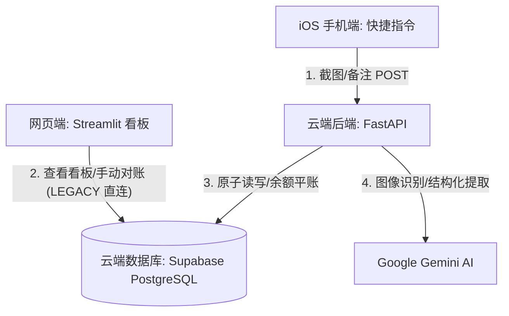

# [LEGACY / HISTORICAL] Vibe Ledger 项目开发文档

> ⚠️ **历史文档归档说明 (LEGACY ARCHIVE)**  
> 本文件记录的是 VibeLedger 早期原型阶段的旧版实现方案（两表模型、硬编码 Literal、单接口 `/api/record`、Dashboard 直接读写数据库）。  
> **本文件不是目标架构规范，严禁作为新功能开发或重构的依据。**  
> 目标架构与业务规范请参见：
> - [`TARGET_DOMAIN_MODEL.md`](../../TARGET_DOMAIN_MODEL.md)（已冻结的业务事实源）
> - [`docs/architecture/`](../architecture/README.md)（目标物理 Schema、API 契约与对账引擎）

---

## 1. 项目概述 (历史原型)

**Vibe Ledger** 早期设计为一款结合大语言模型（Gemini）和多模态识别技术的家庭资产负债与收支管理系统。
系统旨在提供便捷的记账体验，使用户可以通过手机截图（如微信支付凭证、支付宝账单、银行资产概览、股票账户截图等）配合简短备注，直接完成记账或账户余额对账校准，并提供多维度的可视化资产负债与收支统计看板。

---

## 2. 核心需求分析 (历史版本)

系统从功能上主要划分为三大块：**智能记账（FastAPI 后端）**、**数据展示与手动校准（Streamlit 看板）** 和 **便捷录入（iOS 快捷指令）**。

### 2.1 账务与对账需求 (旧版实现)
1. **多类型账户管理**：
   - 资产类账户细分为：
     - **现金钱包** (`cash`，如微信支付、支付宝余额、借记卡活期等）
     - **储蓄存款** (`savings`，如银行定期存款、国债等）
     - **投资资产** (`investment`，如股票、基金、银行理财等）
   - 负债类账户细分为：
     - **信用负债** (`credit`，如信用卡、花呗等）
2. **多币种支持与跨币种转账**：
   - 系统原生支持多币种（如人民币 CNY、美元 USD 等）。
   - 跨币种转账时，需记录转出金额、转入金额及对应的真实汇率，禁止静默 1:1 Fallback。
   - 针对“还清信用卡”等场景，早期系统尝试根据信用卡当前账单金额自动反向推导应还外币/本币金额。
3. **信用卡还款透视**：
   - 针对配置了账单日（`billing_day`）和还款日（`due_day`）的信用卡账户，系统根据当前日期自动核算以下指标：
     - **已出账单 (Statement Balance)**: 上个账单周期内的消费额。
     - **本期已还 (Repaid Amount)**: 账单日后到还款截止日期间，已转账存入信用卡的金额。
     - **本期剩余应还 (Remaining Due)**: 已出账单与本期已还的差额。
     - **未出账单 (Unbilled Balance)**: 当前账单日之后产生的新消费。
4. **分期付款自动分摊 (旧版缺陷实现)**：
   - *[LEGACY 缺陷]*：旧版检测到分期记账指令后，立即按月平摊生成 N 笔未来流水入库并扣减全局当前余额。目标架构已废弃该模式，改为 `installment_plans` 计划表按期通过 Statement 实际确认。
5. **投资资产特殊对账语义 (Adjustment) (旧版语义)**：
   - *[LEGACY 语义]*：旧版将投资类账户对账产生的差额以 `adjustment` 类型记录，并在看板上将其与 `income` 合并统计。目标架构已将 `investment_pnl_periods` 与常规 `cash_income` 严格分离。

### 2.2 防重与并发安全需求
1. **双层防重校验 (旧版实现)**：
   - **第一层（物理幂等键去重）**：客户端请求带上唯一 UUID 作为幂等键，旧版保存在 `transactions.idempotency_key` 上。目标架构已升级为独立的 `ingestion_requests` 请求级幂等控制。
   - **第二层（业务内容去重）**：相同日期、相同金额、相同账户以及剥离分期前缀后备注相同的流水平账拦截，防止手动操作引起的重复录入。
2. **并发余额原子更新**：
   - 账户余额更新采用数据库原生原子更新语句（`UPDATE accounts SET current_balance = current_balance + :delta`），防御 Lost Update 问题。
   - 转账时，对两个账户执行按字母排序后的 `FOR UPDATE` 行级加锁，规避交叉更新引起的死锁。（注：目标架构基于 `account_state` 排序加锁）。

---

## 3. 系统架构设计 (历史版本)

Vibe Ledger 早期架构拓扑：



### 3.1 手机端 (iOS Shortcut)
- **定位**：轻量级记账入口。
- **工作流**：
  1. 用户在手机上截图（微信、支付宝支付凭证或银行账户页面等）。
  2. 触发 iOS 快捷指令。
  3. 提示输入可选备注（例如“分期 12期”或外币交易说明）。
  4. 生成随机 UUID 作为 `idempotency_key`。
  5. 图片 Base64 编码，连同备注和幂等键 POST 至后端的 `/api/record` 接口。
  6. 接收接口返回的格式化文本并弹窗通知。

### 3.2 网页看板端 (Streamlit Dashboard - 历史直连数据库实现)
- **定位**：家庭资产负债中心、财务统计看板与手动对账管理。
- *[LEGACY]*：旧版 Dashboard 直接通过 psycopg2 读写 PostgreSQL。目标架构中 Dashboard 必须完全通过 Backend REST API 交互。
- **页面模块**：
  - **💰 资产负债中心**：
    - 展示折合为人民币（CNY）的总资产、总负债和净资产 KPI。
    - 按现金钱包、储蓄存款、投资资产、信用负债四宫格矩阵，以折叠面板列出所有账户和最近更新时间。
    - **信用卡还款透视**：汇总列出各信用卡的本期应还、未出账单，展示未来的分期付款明细。
    - **资产占比配置**：按活期、低风险、中低风险、中高风险四级梯度展示家庭资产配置饼图。
  - **📊 收支统计中心**：
    - 提供“年份 + 月份”双级联动筛选，显示月度总收/支及净结余。
    - 可按“总收入 vs 总支出趋势”或“指定收支分类趋势”渲染历史月度趋势图。
    - 聚合展示年度收支大账本及月度明细表。
  - **📅 年度统计中心**：
    - 以年为维度，分析全年的累计总收入、总支出、净结余，并展示年度支出/收入占比饼图及月度双柱趋势图。
- **手动对账**：侧边栏提供快速平账表单，允许用户对选定账户直接修改为真实水位，系统自动将其转换为对账流水入库。

### 3.3 云端后端 (FastAPI Backend - 历史实现)
- **定位**：业务逻辑控制中枢。
- **核心功能**：
  - **多模态结构化解析**：接收 Base64 截图与备注，利用 `gemini-3.1-flash-lite` 结合 Prompt 进行意图识别，输出 `ParsedTransaction` JSON。
  - **落库流水分发**：
    - 若交易类型为 `adjustment`：调用对账逻辑（`apply_adjustment`），计算水位差并校准当前余额。
    - 若为普通收支或转账：调用 `insert_record`，进行双层去重，在事务中驱动对应账户余额原子更新，并在需要时处理分期生成多条流水。
  - **接口定义**：
    - `POST /api/record`：旧版主记账/对账接口。
    - `GET /health`：健康检查接口。

### 3.4 云端数据库 (Supabase PostgreSQL - 历史两表结构)
- **定位**：持久化数据存储。
- **[LEGACY] 隔离策略**：
  - 早期通过环境变量 `TABLE_SUFFIX`（如 `accounts_dev`、`transactions_dev`）做表名级隔离。目标架构已废弃该设计，采用独立的 `DATABASE_URL` 与 `DB_SCHEMA` 隔离。
- **历史数据表结构**：

#### 历史账户表 (`accounts`)
| 字段名 | 类型 | 说明 |
| :--- | :--- | :--- |
| `id` | SERIAL (PK) | 账户自增 ID |
| `account_name` | TEXT (UNIQUE) | 账户名称（如 WeChat_Pay, Huabei 等） |
| `account_type` | TEXT | 账户类型（`cash`/`credit`/`savings`/`investment`） |
| `current_balance`| NUMERIC(12, 2) | [LEGACY] 作为事实源的当前余额 |
| `currency` | TEXT | 结算币种（默认 `CNY`） |
| `billing_day` | INTEGER | 信用卡账单日（1-31 号，可空） |
| `due_day` | INTEGER | 信用卡还款日（1-31 号，可空） |
| `updated_at` | TIMESTAMP | 余额最近校准更新时间 |

#### 历史交易流水表 (`transactions`)
| 字段名 | 类型 | 说明 |
| :--- | :--- | :--- |
| `id` | SERIAL (PK) | 交易流水自增 ID |
| `date` | DATE | 交易/消费发生日期 |
| `amount` | NUMERIC(12, 2) | 交易金额 |
| `original_currency`| TEXT | 原始币种 |
| `from_account` | TEXT (FK) | 转出账户名 |
| `to_account` | TEXT (FK) | 转入账户名 |
| `transaction_type` | TEXT | 交易类型（`expense`/`income`/`transfer`/`adjustment`） |
| `category` | TEXT | 交易分类 |
| `remarks` | TEXT | 交易备注说明 |
| `is_installment` | BOOLEAN | 是否为信用卡分期的未来非首期流水标记 |
| `idempotency_key` | TEXT (UNIQUE) | 客户端提供的防重幂等键 |
| `parent_idempotency_key`| TEXT | 分期或平账关联的主/父幂等键 |
| `from_amount` | NUMERIC(12, 2) | 跨币种转账：实际扣除的转出币种金额 |
| `from_currency` | TEXT | 转出币种 |
| `to_amount` | NUMERIC(12, 2) | 跨币种转账：实际到账的转入币种金额 |
| `to_currency` | TEXT | 转入币种 |
| `fx_rate` | NUMERIC(12, 6) | 跨币种转账的实际结算汇率 |
| `created_at` | TIMESTAMP | 记录入库时间 |

---

## 4. 历史部署与环境配置

### 4.1 环境变量配置项示例 (占位符)
```env
# 数据库连接 (Supabase)
DATABASE_URL=postgresql://<username>:<password>@<db_host>:<db_port>/<database_name>

# [LEGACY] 表隔离后缀 (目标架构使用独立 DB_SCHEMA 替代)
TABLE_SUFFIX=_dev

# Google Gemini API 密钥
GEMINI_API_KEY=YOUR_GEMINI_API_KEY_HERE
```

### 4.2 云端后端部署 (Hugging Face Spaces)
- 后端部署在 Hugging Face Spaces 上，采用 Docker 部署模式：
  - 容器基础镜像：`python:3.10-slim`
  - 启动端口：监听 Hugging Face 默认的 `7860` 端口。
  - API 密钥（如 `GEMINI_API_KEY`、`DATABASE_URL`）通过 Hugging Face 控制面板的 **Secrets** 进行配置。
  - *[LEGACY]* 旧版启动时在代码中运行 `database.init_db()` 执行 DDL 更新。目标架构将采用独立的数据库版本化迁移机制。

### 4.3 网页看板部署 (Streamlit Dashboard)
- 看板通过 Docker 容器化部署，暴露端口 `8501`：
  - 容器基础镜像：`python:3.13.5-slim`
  - *[LEGACY 历史注意点]*：历史构建中曾存在根目录下 `app.py` 与 `src/streamlit_app.py` 两个入口文件的不一致。目标架构将清理并统一容器启动入口。
